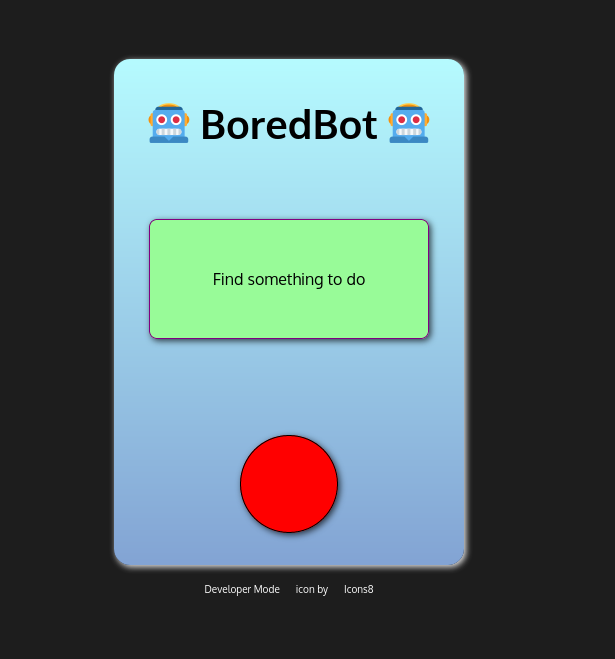

# BoredBot
Exercise in using API's

This application reads an API and displays the content when the button is selected.

### Screenshot

### Links

- Solution URL: https://github.com/mrobbins0422/BoredBot/
- Live Site URL: https://mrobbins0422.github.io/BoredBot/

## My process

### Built with

- Semantic HTML5 markup
- CSS custom properties
- Flexbox
- Mobile-first workflow

